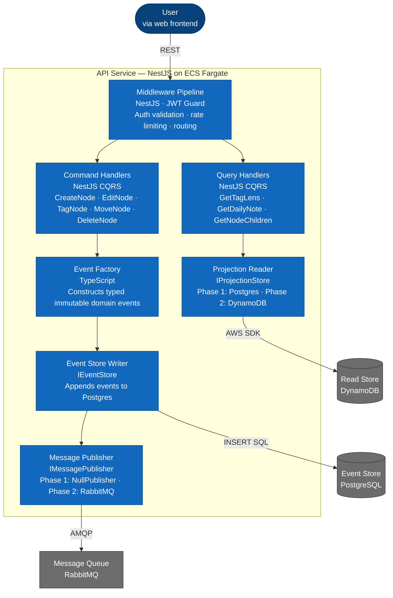
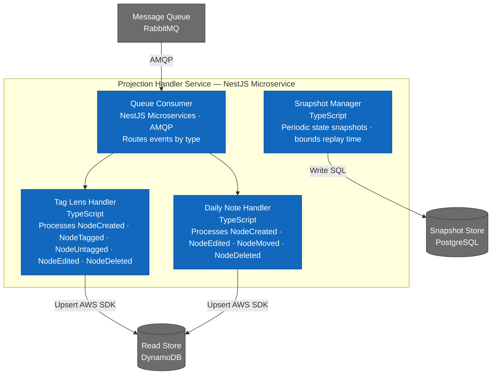

# C4 Level 3 — Component Diagram: API Service

Shows the internal components of the NestJS API service container.

### API Service

### Projection Handler Service

## Component Responsibilities

### API Service

| Component | Responsibility | Interface |
|---|---|---|
| Middleware pipeline | Auth, rate limiting, routing | — |
| Command handlers | One per command type, validates and orchestrates write | — |
| Query handlers | One per query type, reads from projection store | — |
| Event factory | Constructs immutable typed domain events | — |
| Event store writer | Appends to Postgres events table | `IEventStore` |
| Message publisher | Publishes to queue after persist | `IMessagePublisher` |
| Projection reader | Reads from read store | `IProjectionStore` |

### Projection Handler Service

| Component | Responsibility |
|---|---|
| Queue consumer | AMQP listener, routes events by type |
| Tag lens handler | Maintains tag-filtered node projections |
| Daily note handler | Maintains date-ordered node projections |
| Snapshot manager | Periodic state snapshots to bound replay time |

## Key Design Decisions

**Command/query separation is enforced at the component level.** Command handlers never read from the read store. Query handlers never write to the event store. This boundary is maintained by convention and enforced in code review.

**Interface boundaries isolate infrastructure.** The `IEventStore`, `IMessagePublisher`, and `IProjectionStore` interfaces mean no component in the application layer imports directly from a database driver or AWS SDK. All infrastructure dependencies are injected.

**Projection handlers are idempotent.** Each event carries a unique `eventId`. Handlers check this ID before processing to safely handle redelivered messages from the at-least-once queue.
