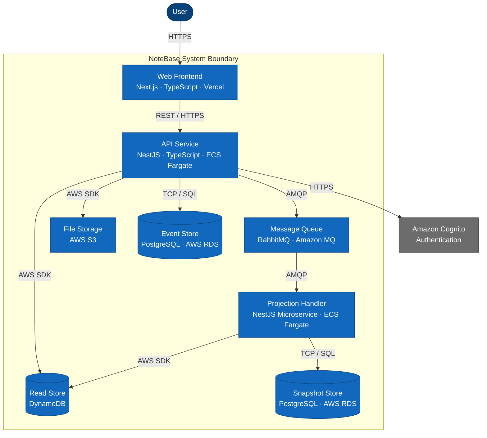

# C4 Level 2 — Container Diagram

Shows the technical building blocks inside NoteBase and how they communicate.

## Phase 1 Substitutions

In local development and the personal-use phase, infrastructure is simplified via interface abstractions (see ADR-006). No application code changes are required.

| Production Component | Phase 1 Equivalent |
|---|---|
| Amazon MQ (RabbitMQ) | No queue — projection handler polls event store directly |
| DynamoDB read store | Postgres projection tables |
| ECS Fargate (projection handler) | Background thread in API process |
| AWS S3 | LocalStack S3 |
| Amazon Cognito | Local JWT mock |

## Communication Protocols

| From | To | Protocol | Notes |
|---|---|---|---|
| Web frontend | API | REST over HTTPS | JSON request/response |
| API | Event store | TCP / SQL | Postgres driver, connection pool |
| API | Queue | AMQP | Publish after event persist — fire and forget |
| Queue | Projection handler | AMQP | At-least-once delivery, explicit ack |
| Projection handler | Read store | AWS SDK | DynamoDB PutItem operations |
| API | Read store | AWS SDK | DynamoDB Query operations |
