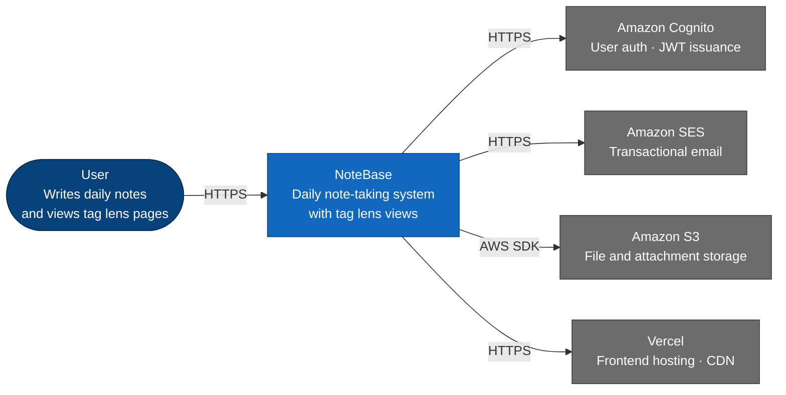

# C4 Level 1 — System Context

Shows how NoteBase fits into the world and the external systems it depends on.

## Elements

| Element | Type | Description |
|---|---|---|
| User | Person | Primary actor — writes and reads notes |
| NoteBase | System | The system being documented |
| Amazon Cognito | External system | Managed auth — handles signup, login, JWT issuance |
| Amazon SES | External system | Transactional email delivery |
| Amazon S3 | External system | Object storage for file attachments |
| Vercel | External system | Next.js frontend hosting |

## Notes

- The context diagram deliberately omits internal infrastructure (RabbitMQ, DynamoDB, RDS) — those are container-level concerns
- A future mobile client would appear here as an additional actor once implemented
- Cognito handles all auth concerns — the API trusts Cognito-issued JWTs and does not manage credentials directly
