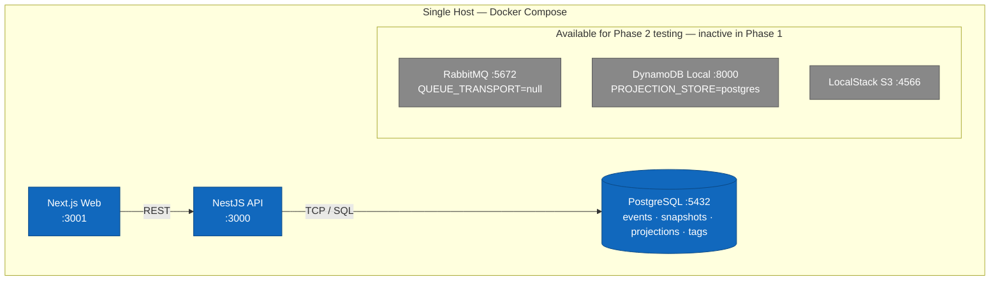
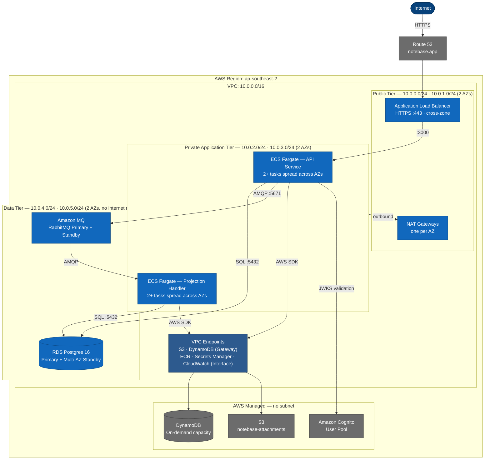
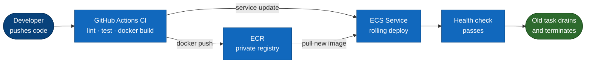

# AWS Deployment Topology

This document describes the AWS infrastructure layout for NoteBase — the network design, component placement, and the progression from Phase 1 to Phase 2. It is a companion to the C4 Container diagram, which shows logical components, and the Security Architecture document, which covers IAM and access controls.

---

## Phase 1 — Local / Single VPS

Phase 1 is not deployed to AWS. The full stack runs locally via Docker Compose on a developer machine or a single VPS (e.g. a $10/month Hetzner or DigitalOcean instance).



RabbitMQ, DynamoDB Local, and LocalStack run in Docker Compose but are not active in Phase 1 (`QUEUE_TRANSPORT=null`, `PROJECTION_STORE=postgres`). They are available for Phase 2 testing without changing the Compose file.

---

## Phase 2 — AWS Deployment

### Region

All resources are deployed to `ap-southeast-2` (Sydney).

### Availability Zones

Phase 2 uses two Availability Zones (`ap-southeast-2a`, `ap-southeast-2b`) for resilience. ECS tasks are distributed across both AZs. RDS is Multi-AZ with the standby in the second AZ.

---

### Network Topology



---

### Subnet Design Rationale

Three subnet tiers enforce the principle of defence in depth:

| Tier | Subnets | What lives here | Internet access |
|---|---|---|---|
| Public | `10.0.0.0/24`, `10.0.1.0/24` | ALB, NAT Gateways | Direct (Internet Gateway) |
| Private (application) | `10.0.2.0/24`, `10.0.3.0/24` | ECS Fargate tasks | Outbound via NAT Gateway only |
| Data | `10.0.4.0/24`, `10.0.5.0/24` | RDS, Amazon MQ | None |

The data subnet has **no route to the internet** — not even via NAT Gateway. The only way to reach RDS or Amazon MQ is from within the VPC via security group rules.

---

### Security Groups

#### `sg-alb` — Application Load Balancer

| Direction | Protocol | Port | Source |
|---|---|---|---|
| Inbound | TCP | 443 | `0.0.0.0/0` |
| Inbound | TCP | 80 | `0.0.0.0/0` (redirects to 443) |
| Outbound | TCP | 3000 | `sg-api` |

#### `sg-api` — API ECS Tasks

| Direction | Protocol | Port | Source / Destination |
|---|---|---|---|
| Inbound | TCP | 3000 | `sg-alb` |
| Outbound | TCP | 5432 | `sg-rds` |
| Outbound | TCP | 5671 | `sg-mq` |
| Outbound | TCP | 443 | VPC endpoints (DynamoDB, S3, Secrets Manager, ECR, CloudWatch) |

#### `sg-projection` — Projection Handler ECS Tasks

| Direction | Protocol | Port | Source / Destination |
|---|---|---|---|
| Inbound | (none) | — | No inbound traffic accepted |
| Outbound | TCP | 5671 | `sg-mq` |
| Outbound | TCP | 5432 | `sg-rds` |
| Outbound | TCP | 443 | VPC endpoints |

#### `sg-rds` — RDS Postgres

| Direction | Protocol | Port | Source |
|---|---|---|---|
| Inbound | TCP | 5432 | `sg-api` |
| Inbound | TCP | 5432 | `sg-projection` |
| Outbound | (none) | — | No outbound rules needed |

#### `sg-mq` — Amazon MQ (RabbitMQ)

| Direction | Protocol | Port | Source |
|---|---|---|---|
| Inbound | TCP | 5671 | `sg-api` |
| Inbound | TCP | 5671 | `sg-projection` |
| Inbound | TCP | 443 | `sg-api` (management console, restricted) |
| Outbound | (none) | — | No outbound rules needed |

---

### Component Specifications (Phase 2 baseline)

| Component | AWS Service | Specification | Multi-AZ |
|---|---|---|---|
| Frontend | Vercel | Managed | Yes (Vercel CDN) |
| API | ECS Fargate | 0.5 vCPU / 1GB RAM, min 1 task | Yes (tasks spread across AZs) |
| Projection handler | ECS Fargate | 0.25 vCPU / 512MB RAM, min 1 task | Yes |
| Event store | RDS Postgres 18 | db.t3.small, 20GB gp3, Multi-AZ | Yes |
| Read store | DynamoDB | On-demand capacity | Yes (AWS managed) |
| Message queue | Amazon MQ | mq.t3.micro, single-instance | Phase 2: single, Phase 3: active/standby |
| File storage | S3 | Standard storage class | Yes (AWS managed) |
| Auth | Amazon Cognito | User Pool, ap-southeast-2 | Yes (AWS managed) |
| DNS | Route 53 | Hosted zone for notebase.app | Yes |
| TLS certificates | ACM | `notebase.app`, `*.notebase.app` | Yes |
| Container registry | ECR | Private repository per service | Yes |
| Secrets | Secrets Manager | Per-service secret paths | Yes |

---

### Traffic Flow — Write Path

```
1. User browser ──HTTPS──► Route 53 ──► ALB (public subnet)
2. ALB ──► sg-api ──► API ECS task (private subnet)
3. API task ──► sg-rds ──► RDS Postgres (data subnet) [INSERT event]
4. API task ──► sg-mq ──► Amazon MQ (data subnet) [PUBLISH event]
5. API task ──► ALB ──► User browser [202 Accepted]
6. Amazon MQ ──► sg-projection ──► Projection Handler ECS task [DELIVER event]
7. Projection Handler ──► DynamoDB via VPC endpoint [PutItem]
```

### Traffic Flow — Read Path

```
1. User browser ──HTTPS──► Route 53 ──► ALB (public subnet)
2. ALB ──► sg-api ──► API ECS task (private subnet)
3. API task ──► DynamoDB via VPC endpoint [Query]
4. API task ──► ALB ──► User browser [200 response]
```

Note: The event store (RDS) is not involved in the read path.

---

### DNS and TLS

- Route 53 hosts the `notebase.app` hosted zone.
- The ALB is the single DNS target. `api.notebase.app` and `notebase.app` (frontend) both resolve to the ALB, with ALB listener rules routing by hostname.
- TLS certificates are issued by ACM and attached to the ALB listener. Certificate renewal is automatic.
- HSTS is enforced via an ALB response header rule (`Strict-Transport-Security: max-age=31536000; includeSubDomains`).

---

### Container Image Pipeline



- ECR image scanning is enabled. Images with critical vulnerabilities are blocked from deployment.
- Each service has its own ECR repository: `notebase/api`, `notebase/projection-handler`.
- Images are tagged with the git commit SHA for traceability.

---

### Cost Model (Phase 2 estimates, ap-southeast-2)

These are indicative estimates for a low-traffic Phase 2 deployment. Actual costs depend on usage patterns.

| Service | Specification | Estimated monthly cost (AUD) |
|---|---|---|
| ECS Fargate — API | 0.5 vCPU / 1GB, 1 task, always-on | ~$20 |
| ECS Fargate — Projection Handler | 0.25 vCPU / 512MB, 1 task, always-on | ~$10 |
| RDS Postgres | db.t3.small, Multi-AZ, 20GB | ~$60 |
| Amazon MQ | mq.t3.micro, single-instance | ~$25 |
| ALB | 1 ALB, low traffic | ~$25 |
| NAT Gateway | 2 AZs, low data transfer | ~$70 |
| DynamoDB | On-demand, < 1M requests/month | ~$5 |
| S3 | < 10GB storage, low requests | ~$5 |
| CloudWatch | Logs, metrics, alarms | ~$15 |
| Route 53 | 1 hosted zone | ~$1 |
| ACM | Free | $0 |
| Cognito | < 50,000 MAU free tier | $0 |
| **Total** | | **~$236/month** |

**Cost observations:**
- NAT Gateway data processing ($0.059/GB) dominates at higher traffic. VPC endpoints for DynamoDB and S3 eliminate NAT data transfer costs for those services.
- RDS Multi-AZ doubles the instance cost compared to single-AZ — this is the price of the 99.9% availability target.
- Amazon MQ has a minimum instance cost regardless of message volume. This is the vendor-portability tradeoff accepted in ADR-005.
- At Phase 2 scale (~1,000 users), DynamoDB on-demand costs remain minimal. This changes meaningfully at Phase 3.

**Phase 1 local cost: ~$0/month** (Docker Compose on existing hardware or a ~$10/month VPS).

---

### Phase 3 Topology Changes

When moving from Phase 2 to Phase 3, the following infrastructure changes are anticipated. No application code changes are required.

| Change | Trigger | Action |
|---|---|---|
| API auto-scaling | CPU > 70% sustained | ECS Service Auto Scaling, target tracking policy |
| RDS vertical scale | CPU > 60% or IOPS saturation | db.t3.small → db.t3.medium → db.t3.large |
| RDS read replica | Read query latency degrading | Add read replica, route query handlers to replica endpoint |
| Amazon MQ active/standby | Single-instance MQ is a reliability risk | Upgrade to active/standby broker pair |
| DynamoDB reserved capacity | Sustained predictable throughput | Purchase reserved capacity for cost reduction |
| CloudFront | Frontend latency outside Sydney | Add CloudFront distribution in front of Vercel or ALB |
| AWS WAF | > 10,000 MAU | Enable WAF on ALB with rate limiting and OWASP managed rules |
