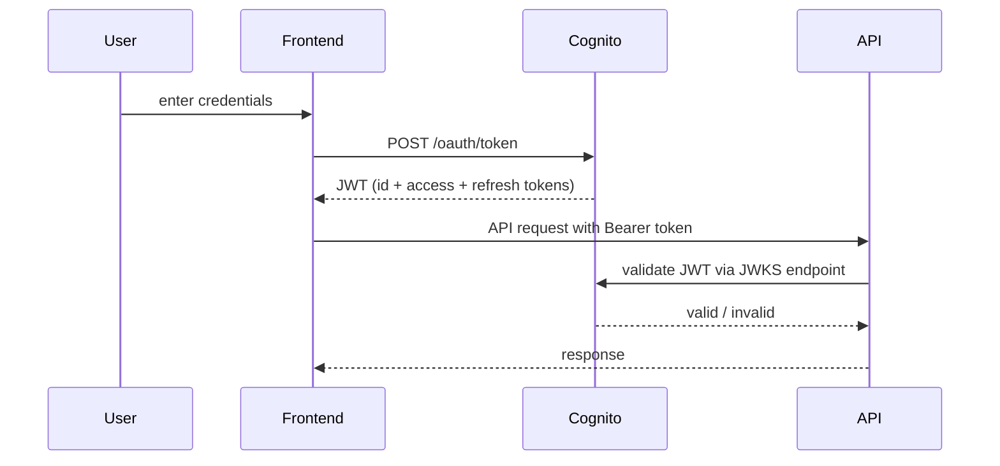

# Security Architecture

This document describes the security model for NoteBase — authentication, authorisation, network security, secrets management, and the threat model the architecture is designed to address.

---

## Security Principles

- **Defence in depth** — security controls exist at multiple layers. A failure in one layer does not expose the system.
- **Least privilege** — every component has only the permissions it needs to perform its function.
- **Zero trust networking** — no component trusts another by virtue of network location. All service-to-service communication is authenticated.
- **Data minimisation** — personal data is scoped strictly to the authenticated user. No component has access to another user's data.

---

## Authentication

NoteBase delegates all identity management to **Amazon Cognito**. The API does not manage credentials, sessions, or password storage.

### Authentication flow



### Token handling

| Token | Lifetime | Purpose |
|---|---|---|
| Access token | 1 hour | Sent with every API request in `Authorization: Bearer` header |
| ID token | 1 hour | Contains user identity claims (`sub`, `email`) |
| Refresh token | 30 days | Used by frontend to silently refresh expired access tokens |

- Tokens are stored in memory on the frontend — not in `localStorage` or cookies — to mitigate XSS token theft.
- The refresh token is stored in an `HttpOnly`, `Secure`, `SameSite=Strict` cookie, inaccessible to JavaScript.
- Token refresh is handled silently in the background. The user is only prompted to re-authenticate when the refresh token expires.

### JWT validation (API)

Every inbound request to a protected endpoint is validated by the NestJS JWT Guard:

1. Extract the `Authorization: Bearer <token>` header
2. Verify the JWT signature against Cognito's public JWKS endpoint (`https://cognito-idp.{region}.amazonaws.com/{userPoolId}/.well-known/jwks.json`)
3. Verify the token has not expired (`exp` claim)
4. Verify the `aud` claim matches the API's Cognito App Client ID
5. Extract `sub` (Cognito user ID) and attach to the request context as `userId`
6. Reject with 401 if any validation step fails

The JWKS public keys are cached in memory and refreshed on a configurable interval (default: 1 hour). This avoids a network call to Cognito on every request.

---

## Authorisation

NoteBase uses **resource-owner authorisation** — all data access is scoped to the authenticated user's `userId`. There are no roles, groups, or shared resources in the initial implementation.

### Enforcement points

| Layer | Enforcement |
|---|---|
| Command handlers | `userId` is taken from the validated JWT, never from the request body. The client cannot claim a different user identity. |
| Event store | Every event row carries `user_id`. Queries against the event store always include `WHERE user_id = $userId`. |
| Projection store | Every projection row carries `user_id`. All read queries filter by `userId`. |
| DynamoDB partition keys | Partition keys are prefixed with `USER#{userId}`. A query with an incorrect userId prefix returns no results. |

### What the client cannot do

- Claim a `userId` other than the one in their JWT
- Read another user's events, projections, or tags
- Write events on behalf of another user
- Access any projection data without a valid JWT

---

## Network Security

See the AWS Deployment Topology document for the full VPC layout. The summary of network security controls:

### Perimeter

- The only public-facing component is the **Application Load Balancer (ALB)**.
- The ALB terminates TLS. All traffic between the internet and the ALB is HTTPS (TLS 1.2 minimum, TLS 1.3 preferred).
- The ALB has a **security group** that accepts inbound traffic on port 443 from `0.0.0.0/0` only. Port 80 redirects to 443.
- The ALB has a **WAF (AWS WAF)** rule set attached in Phase 2+ for rate limiting and common attack pattern blocking (OWASP Top 10 ruleset).

### Internal network

- All application components (ECS tasks, RDS, Amazon MQ) run in **private subnets** with no direct internet access.
- Components communicate via **security group rules** — not network ACLs. Security group rules define the minimum necessary ingress:

| From | To | Port | Protocol |
|---|---|---|---|
| ALB | API ECS task | 3000 | TCP |
| API ECS task | RDS Postgres | 5432 | TCP |
| API ECS task | Amazon MQ | 5671 | TCP (AMQP/TLS) |
| Projection handler ECS task | Amazon MQ | 5671 | TCP (AMQP/TLS) |
| Projection handler ECS task | RDS Postgres | 5432 | TCP |
| ECS tasks (outbound) | NAT Gateway | 443 | HTTPS (for AWS API calls) |

- No security group allows inbound traffic from `0.0.0.0/0` except the ALB on port 443.
- RDS has no public accessibility enabled. It is not reachable from outside the VPC under any circumstances.

### VPC endpoints

To avoid traffic to AWS services (DynamoDB, S3, Secrets Manager) leaving the VPC and traversing the public internet:

- **Gateway endpoint** for S3 and DynamoDB — routes traffic to these services via the AWS backbone, at no additional cost.
- **Interface endpoint** for Secrets Manager — required for ECS tasks to retrieve secrets at startup without internet access.

---

## IAM

### Principle of least privilege

Each ECS task has a dedicated **IAM Task Role**. The task role is attached to the ECS task definition, not to the EC2 instance or the ECS cluster. Tasks assume their role automatically via the ECS credentials provider.

### API Task Role

```json
{
  "Version": "2012-10-17",
  "Statement": [
    {
      "Effect": "Allow",
      "Action": ["dynamodb:Query", "dynamodb:GetItem"],
      "Resource": [
        "arn:aws:dynamodb:ap-southeast-2:ACCOUNT:table/notebase-tag-lens",
        "arn:aws:dynamodb:ap-southeast-2:ACCOUNT:table/notebase-daily-note"
      ]
    },
    {
      "Effect": "Allow",
      "Action": ["s3:PutObject", "s3:GetObject", "s3:GeneratePresignedUrl"],
      "Resource": "arn:aws:s3:::notebase-attachments/*"
    },
    {
      "Effect": "Allow",
      "Action": ["secretsmanager:GetSecretValue"],
      "Resource": "arn:aws:secretsmanager:ap-southeast-2:ACCOUNT:secret:notebase/api/*"
    }
  ]
}
```

### Projection Handler Task Role

```json
{
  "Version": "2012-10-17",
  "Statement": [
    {
      "Effect": "Allow",
      "Action": ["dynamodb:PutItem", "dynamodb:UpdateItem", "dynamodb:DeleteItem"],
      "Resource": [
        "arn:aws:dynamodb:ap-southeast-2:ACCOUNT:table/notebase-tag-lens",
        "arn:aws:dynamodb:ap-southeast-2:ACCOUNT:table/notebase-daily-note"
      ]
    },
    {
      "Effect": "Allow",
      "Action": ["secretsmanager:GetSecretValue"],
      "Resource": "arn:aws:secretsmanager:ap-southeast-2:ACCOUNT:secret:notebase/projection-handler/*"
    }
  ]
}
```

---

## Secrets Management

No secrets are stored in environment variables, source code, or container images. All secrets are stored in **AWS Secrets Manager** and injected at container startup via the ECS secrets integration.

| Secret | Path | Consumed by |
|---|---|---|
| Postgres connection string | `notebase/api/database-url` | API, Projection Handler |
| RabbitMQ connection string | `notebase/api/rabbitmq-url` | API, Projection Handler |
| Cognito App Client ID | `notebase/api/cognito-client-id` | API |
| Cognito User Pool ID | `notebase/api/cognito-user-pool-id` | API |

Secrets are rotated on a schedule via Secrets Manager rotation functions. Application code reads secrets at startup — a container restart is required to pick up a rotated secret (handled by the ECS deployment process).

---

## Data Security

### Encryption at rest

| Store | Mechanism | Key management |
|---|---|---|
| RDS Postgres | AES-256, RDS encryption | AWS managed key (Phase 2), CMK (Phase 3) |
| DynamoDB | AES-256, default encryption | AWS managed key |
| S3 (attachments) | SSE-S3 (AES-256) | AWS managed key |
| Secrets Manager | AES-256 | AWS managed key |

### Encryption in transit

- All external traffic: TLS 1.2 minimum, TLS 1.3 preferred. Enforced at the ALB.
- API → RDS: SSL connection required. The Postgres connection string includes `sslmode=require`.
- API → Amazon MQ: AMQP over TLS (port 5671). Plaintext AMQP (port 5672) is disabled on the Amazon MQ broker.
- API → DynamoDB: HTTPS via AWS SDK (default).
- API → S3: HTTPS via AWS SDK (default).

### Data isolation

- Every row in the event store includes `user_id`. Queries always filter by the authenticated user's ID.
- DynamoDB partition keys encode `userId` in the key prefix. Cross-user data access at the partition level is structurally impossible.
- S3 object keys are prefixed with `users/{userId}/`. Bucket policy denies access to objects where the key prefix does not match the requesting IAM identity's `userId` tag.

---

## Threat Model

### In scope threats

| Threat | Vector | Mitigation |
|---|---|---|
| Unauthorised data access | Missing or invalid JWT | JWT Guard rejects all requests without a valid Cognito-issued token |
| Cross-user data access | Manipulated request body with another user's ID | `userId` is always taken from the JWT, never the request body |
| Token theft (XSS) | Malicious script reading access token | Access token stored in memory only, not `localStorage` |
| Token theft (CSRF) | Cross-site request forging refresh | Refresh token in `HttpOnly`/`SameSite=Strict` cookie |
| Injection attacks | Malicious input in node content | NestJS class-validator on all command DTOs; parameterised queries only |
| Brute force auth | Repeated login attempts | Cognito provides built-in account lockout and rate limiting |
| Privilege escalation | Compromised ECS task accessing other services | IAM task roles with least-privilege; no wildcard permissions |
| Data exfiltration via S3 | Direct S3 access with guessed object key | Bucket policy enforces `userId` prefix match; no public bucket access |
| Queue poisoning | Malformed event injected into RabbitMQ | RabbitMQ is in a private subnet, accessible only from API security group |
| Event store corruption | Direct database access | RDS is in a private subnet with no public accessibility; only API security group has ingress |

### Out of scope threats (Phase 2)

| Threat | Reason out of scope |
|---|---|
| DDoS at network layer | Requires AWS Shield Advanced — evaluated at Phase 3 |
| Account takeover via social engineering | Cognito MFA is available but not mandated in Phase 2 |
| Advanced persistent threat (APT) | Out of scope for personal/early SaaS product |
| Supply chain compromise (npm) | Mitigated by dependency audits in CI; full SBOM tracking is a Phase 3 concern |

---

## Security Testing

| Test type | Frequency | Tool |
|---|---|---|
| Dependency vulnerability scan | Every CI build | `npm audit` / Dependabot |
| SAST (static analysis) | Every CI build | ESLint security rules |
| JWT validation unit tests | Every CI build | Jest |
| Authorisation boundary tests | Every CI build | Integration test suite |
| OWASP Top 10 scan | Before each production release | OWASP ZAP (automated) |
| Manual penetration test | Annually (Phase 3) | External party |
